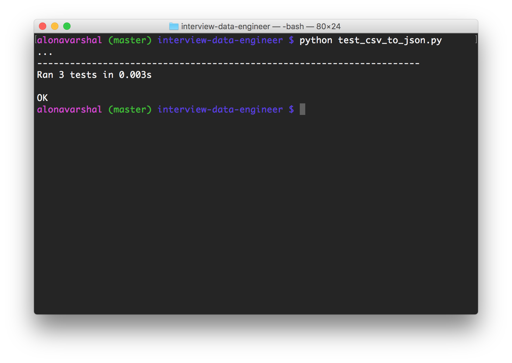

# Project Assignment

Write code to extract data from **data.csv**.

The data contains four columns. The first column is the person identifier. The second column is the datetime the person entered the floor. The third column is the floor the person accessed. The fourth column specifies the building the floor is in.

Each row is considered a floor access event. Your task it to output each floor access event in json format. Each event should comply with the schema located in **schema.json**.

You may use any programming language. When finished, upload code to your Github account and send us the link. Please include instructions on how to execute and test code. Good luck!

# Instructions to Excecute and Test Code

The main program is `csv_to_json.py`. Run code by executing `python csv_to_json.py`. Result is saved in file named `output.json`. To test code, run `python test_csv_to_json.py` which requires data files `data_test1.csv`, `data_test2.csv`, and `data_test3.csv`. Below is the result of the test.

